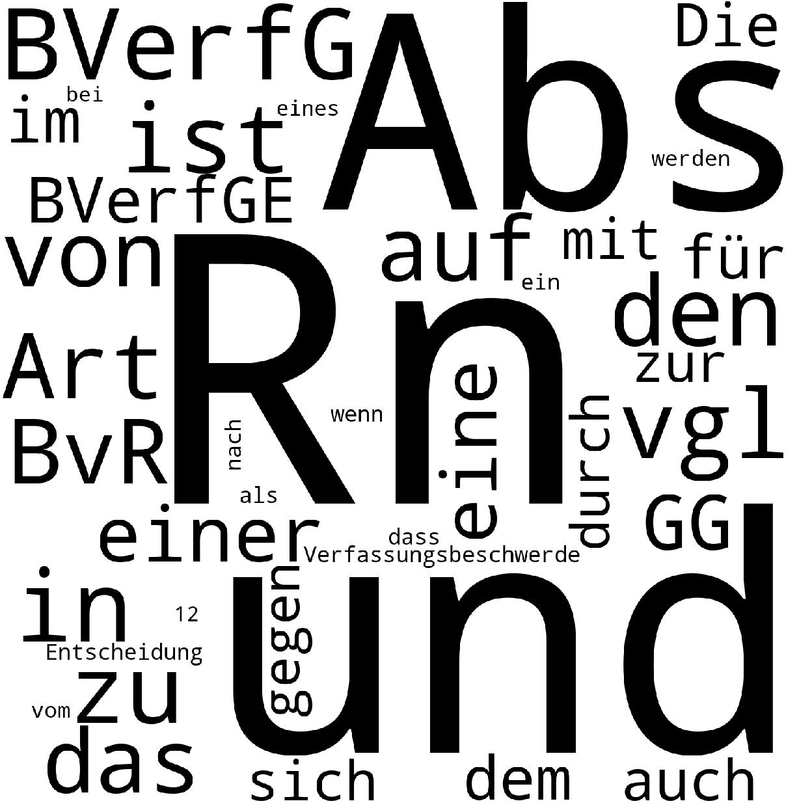
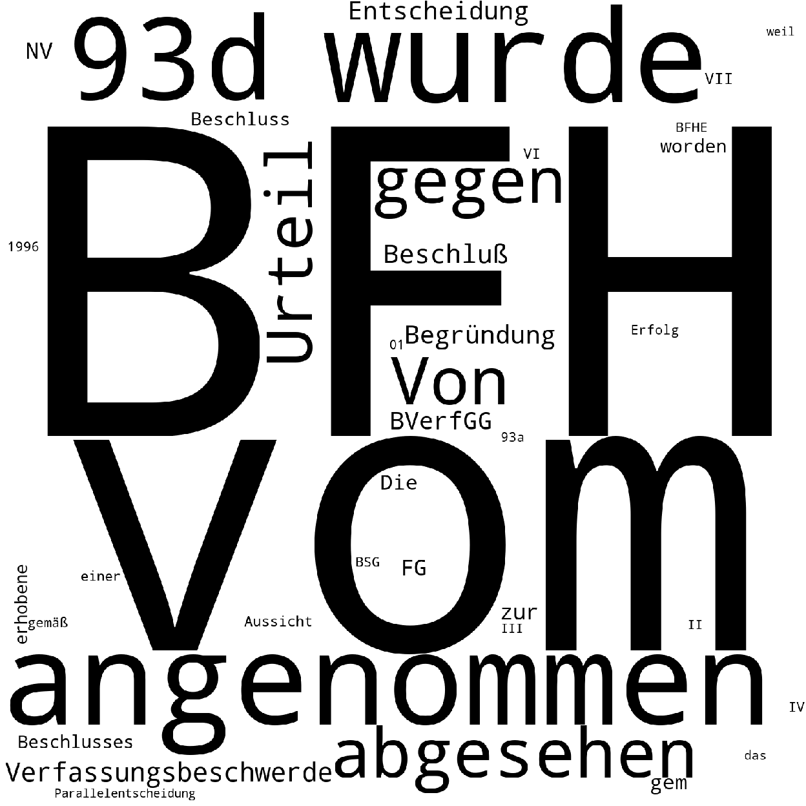
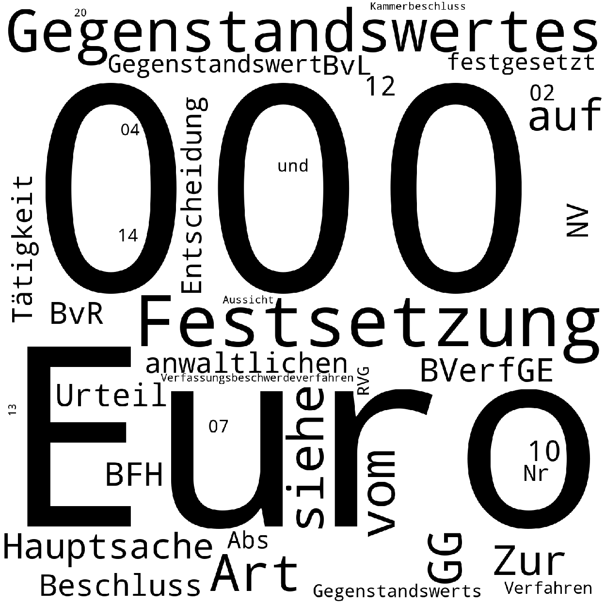

`GET /juris/_mapping` -> to get list of fields

### 1407979 overall
`GET /juris/_count`  

### 334863 before 1990
    GET /juris/_count
    {
      "query": {
        "range": {
          "date": {
            "lte": "1990-01-01"
          }
        }
      }
    }
    
### at least 255 have no HTML-doc but a PDF
    
    GET /juris/_count
    {
      "query": {
        "multi_match": {
          "query": "Im neuen Fenster: das folgende PDF-Dokument",
          "type": "phrase"
        }
      }
    }
    
### 16197 decisions from Bundesverfassungsgericht

    GET /juris/_count
    {
      "query": {
        "match_phrase": {
          "zitiervorschlag": "BVerfG"
        }
      }
    }
    
### field counts
           count                        field
    18  1407979                          url
    16  1407979                     subtitle
    14  1407979                         date
    13  1407979                      content
    17  1407959                        title
    12  1407147                 aktenzeichen
    19  1406787              zitiervorschlag
    15  1405620           entscheidungsdatum
    11   783570                        Tenor
    5    704645            Orientierungssatz
    4    562153                     Leitsatz
    3    556791                       Gründe
    10   494909                   Tatbestand
    1    494902          Entscheidungsgründe
    9    196906  Sonstiger Orientierungssatz
    8     25293           Sonstiger Langtext
    7      3218           Sonstiger Kurztext
    6       677                  Rechtsfrage
    0       365          Abweichende Meinung
    2        91           Erledigungsvermerk

* 14467 decisions do not contain any of the following fields

        ['Abweichende Meinung', 'Entscheidungsgründe', 'Erledigungsvermerk', 'Gründe', 'Leitsatz', 'Orientierungssatz', 'Rechtsfrage', 'Sonstiger Kurztext', 'Sonstiger Langtext', 'Sonstiger Orientierungssatz', 'Tatbestand']

# [Latent Semantic Analysis on 'Orientierungsatz'](openknowledge/german_legal_data/latent_semantic_analysis.py)
* not sure whether these wordclouds make any sense

### dimension 0 

### dimension 1 

### dimension 6 
